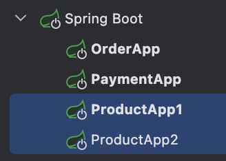

# Stream Processing

이 프로젝트는 SAGA 패턴을 적용하고 RabbitMQ를 사용하여 메시지 기반의 시스템을 구현합니다.

## Getting Started

먼저, Docker를 사용하여 RabbitMQ를 설치합니다. 다음 명령어를 사용하여 RabbitMQ 컨테이너를 실행합니다:

```bash
docker run -d --name rabbitmq -p 5672:5672 -p 15672:15672 --restart=unless-stopped rabbitmq:management
```

### Application

[Order App] 웹 서버를 시작하고 REST API 등을 제공하기 위해 8080 port 사용
[Product, Payment App] 웹 서버 없이 RabbitMQ의 AMQP 프로토콜을 사용하여 메시지 처리


### RabbitMQ Monitoring DashBoard

http://localhost:15672
id:guest, password:guest

### Request URL

[OrderApp] http://localhost:8080/order/1

### Result

OrderApp에서 요청 할 때마다 Product App이 번갈아 가면서 메시지를 수신